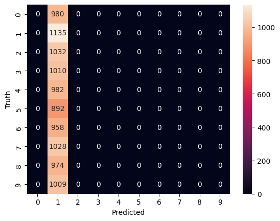

# MNIST Digit Classification using CNN

This repository contains a Convolutional Neural Network (CNN) implementation for classifying handwritten digits from the MNIST dataset. The model achieves high accuracy on the test set, demonstrating its effectiveness for digit recognition tasks.

## Project Overview

The goal of this project is to create and train a CNN to classify handwritten digits from the MNIST dataset, which consists of 28x28 pixel grayscale images of digits (0-9).

## Files

- `mnist_cnn.py`: Python script containing the CNN model implementation, training, and evaluation.
- `README.md`: This file.

## Dependencies

To run this project, you'll need to have the following Python libraries installed:

- `numpy`
- `pandas`
- `tensorflow`
- `keras`
- `matplotlib`
- `seaborn`
- `scikit-learn`

You can install these dependencies using pip:

```bash
pip install numpy pandas tensorflow keras matplotlib seaborn scikit-learn
```

# Usage and Results

## Usage

### Load the MNIST Dataset

The dataset is automatically loaded and split into training and test sets using TensorFlow. The `keras.datasets.mnist.load_data()` function handles this process.

### Preprocess the Data

The images are reshaped from their original dimensions of 28x28 to include a single channel for grayscale and normalized to the range [0, 1] by dividing pixel values by 255. This normalization helps in speeding up the training process and improves model performance.

### Define the CNN Model

The CNN architecture defined in the `CNN()` function includes:

- **Two sets of convolutional layers**, each followed by:
  - **Batch normalization** to stabilize and accelerate training.
  - **ReLU activation** to introduce non-linearity.
  - **Max pooling** to reduce spatial dimensions.
  - **Dropout** to prevent overfitting.

- **A flattening layer** that converts the 2D matrix into a 1D vector.
- **Two dense layers**:
  - One with ReLU activation for learning complex patterns.
  - One with a softmax activation for classification into one of the 10 digit classes.

### Compile the Model

The model is compiled using:
- **Adam optimizer** for efficient training.
- **Categorical crossentropy** as the loss function for multi-class classification problems.

### Train the Model

The model is trained with:
- **5 epochs** and a **batch size of 64**.
- Training includes validation on the test set to monitor performance.

### Evaluate the Model

After training, the model's performance is evaluated by:
- **Generating predictions** on the test set.
- **Comparing these predictions with true labels** to create a confusion matrix.
- **Visualizing the confusion matrix** using seaborn to understand the classification performance across different digit classes.

## Results

The model achieves an accuracy of **99.27%** on the MNIST test set. This high accuracy indicates that the model is highly effective in recognizing handwritten digits. The confusion matrix provides detailed insights into the performance, showing how often each digit was correctly or incorrectly classified.

### Example Confusion Matrix

Here is an example of the confusion matrix generated by the model:


